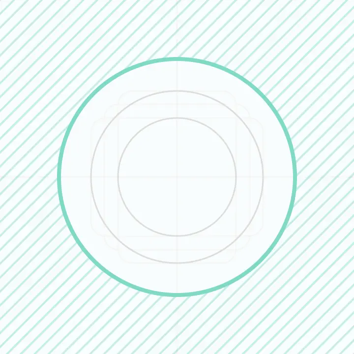
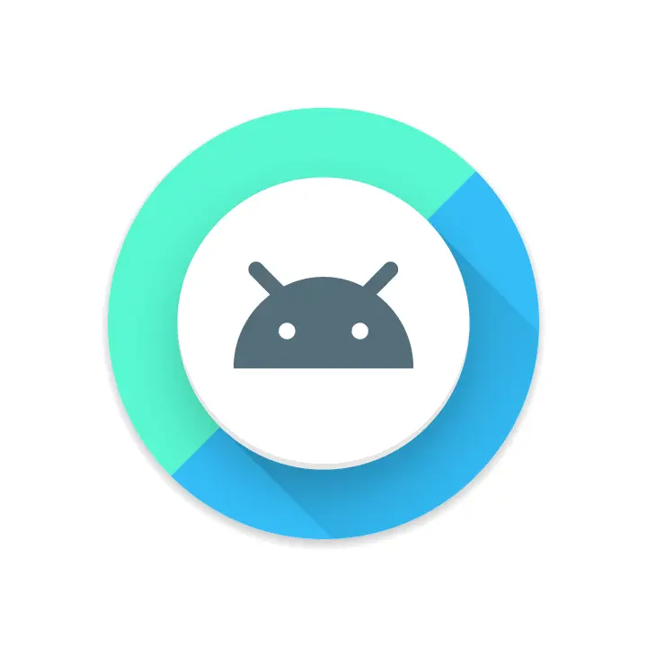
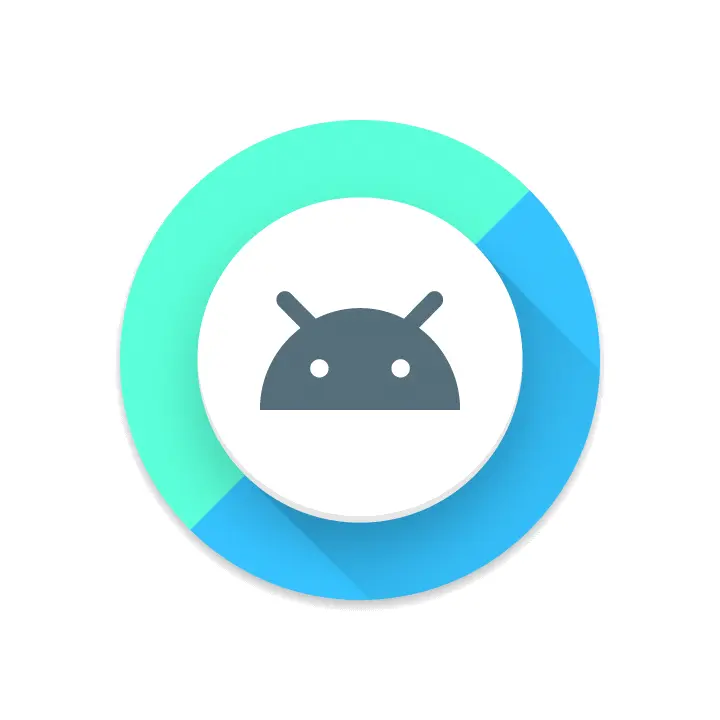

> Android O 引入了 **“自适应桌面图标”**，能在不同的设备型号上显示不同的图标形状。比如同一个桌面图标在一家 OEM 厂商的设备上显示为圆形，在另一家则可以显示为方形。
> 各个 OEM 厂商可提供一个标准形状，交给系统将所有应用的自适应图标渲染为相同形状。新的桌面图标还将应用在快捷方式、“设置”应用、分享对话框等地方。

## 说明





自适应图标可提供多种形状

通过定义两张图层（前景与背景）你可以制定你的桌面图标外观，你必须提供**没有形状、阴影的 PNG 格式图象**作为图层 Drawable。


自适应图标由两张图层和一个形状定义

在以前的 Android 版本中，桌面图标大小定义为 `48 x 48 dp`。现在你必须按照以下的规范定义你的图层大小：

- 两张图层大小都必须为 `108 x 108 dp`。
- **图层中心 72 x 72 dp 范围为可视范围。**
- 系统会**保留**四周外的 36dp 范围用于生成有趣的视觉效果（如视差效果和跳动）。




自适应图标支持各种动效

## 创建自适应图标

要给你的应用添加自适应图标，需要先在你的应用定义 AndroidManifest.xml 中为 `android:icon` 属性指定一个 Drawable 资源。你还可以为 `android:roundIcon` 属性指定一个图标，但只有你需要给应用设置一个特别的圆形图标时才要用到这个属性。下面的代码将示范这两个属性的用法：

```xml
<application
…
android:icon="@mipmap/ic_launcher"
android:roundIcon="@mipmap/ic_launcher_round"
…>
</application>
```

接下来，你需要为 Android O 在你的应用项目中创建一个备选 Drawable 资源 **res/mipmap-anydpi/ic_launcher.xml**。使用 `<maskable-icon>` 元素为你的图标定义前景和背景图层。`<background>` 和 `<foreground>` 元素都支持 `android:drawable` 属性。

```xml
<maskable-icon>
 <background android:drawable="@color/ic_background"/>
 <foreground android:drawable="@mipmap/ic_foreground"/>
</maskable-icon>
```

如果你没有为你的桌面图标更新（提供）**必要的图层**，图标不会和系统 UI 中其它图标形状保持一致，也不支持视觉效果。

> 原文地址：<https://developer.android.com/preview/features/adaptive-icons.html>，本译文由烧饼翻译
