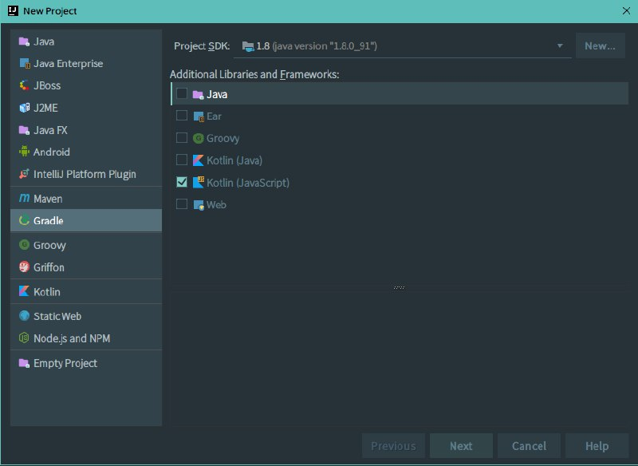
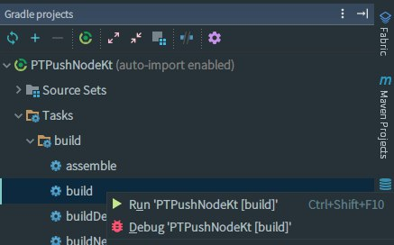
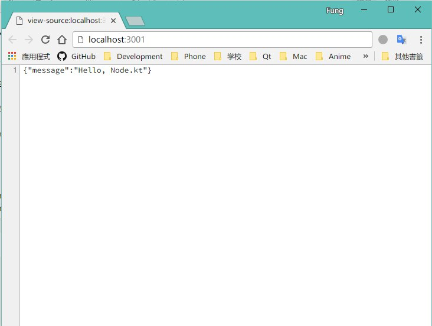

> Kotlin 是一个基于 JVM 的新的编程语言，由 JetBrains 爸爸开发，我们都知道它可以编译为 Java 字节码，有完善的 IDE 支持，还可以作为
> Android 开发语言。除此以外，还可以编译为 JavaScript，在 JVM 虚拟机外运行。


今天准备使用 Node.js 偶然想起 Kotlin 可以编译为 JavaScript，忽然脑洞大开想试试用 Kotlin 写 Node
程序，查找相关资料时发现已经有人尝试过，但目前还没有中文的相关文章，便打算在自己尝试后写这篇非常简单的介绍。

## 建立 Kotlin JavaScript 项目

Node.js 配置起来比较方便，我们可以先在 IntelliJ IDEA 中建立好 Gradle + Kotlin (JavaScript) 项目：



创建好后，我们修改一下 build.gradle，让 Kotlin 编译为 Node.js 适用的 JavaScript 并输出到指定位置便于寻找：

```groovy
group 'moe.feng'
version '1.0-SNAPSHOT'

buildscript {
    ext.kotlin_version = '1.1.4'

    repositories {
        mavenCentral()
    }
    dependencies {
        classpath "org.jetbrains.kotlin:kotlin-gradle-plugin:$kotlin_version"
    }
}

apply plugin: 'kotlin2js'

repositories {
    mavenCentral()
}

dependencies {
    compile "org.jetbrains.kotlin:kotlin-stdlib-js:$kotlin_version"
}

compileKotlin2Js.kotlinOptions {
    moduleKind = "commonjs"
    outputFile = "out/launch.js"
}
```

其中 `moduleKind` 十分重要，必须要将其设置为 `commonjs` 。

## 配置 Node.js

首先，你的系统必须安装好 Node.js。然后我们开始通过 npm 包管理来配置项目。

在你的项目目录中执行：

```shell
npm init
```

然后安装必要的 Kotlin 依赖，以及我们下面演示需要的 Express 依赖：

```shell
npm install kotlin --save
npm install express --save
```

Node.js 就已经配置好在你的项目了。接下来，你还可以根据自己需求修改 `package.json`，
在这里重点是加上 `start` 的脚本便于使用：

```json
{
  "name": "pt-push",
  "version": "1.0.0",
  "description": "Node.kt Example",
  "scripts": {
    "start": "node ./out/launch.js"
  },
  "author": "fython",
  "license": "MIT",
  "dependencies": {
    "express": "^4.15.4",
    "kotlin": "^1.1.4",
    "mongoose": "^4.11.7"
  }
}
```

## Hello, Kotlin!

项目环境准备好了，我们可以写一个主函数作为程序执行入口，并存放在 `src/main/kotlin` 文件夹下：

```kotlin
import kotlin.js.json

external fun require(module:String):dynamic // 引入 Node.js 函数、常量
external val process:dynamic

const val DEFAULT_PORT = 3001

fun main(args: Array<String>) {
    println("Hello, Node.kt!")

    val express = require("express")
    val app = express()

    app.get("/", { _, res ->
        res.type("text/json")
        res.send(json("message" to "Hello, Node.kt"))
    })

    val port = process.env.PORT ?: DEFAULT_PORT

    app.listen(port, {
        println("Listening on port $port")
    })
}
```

## 运行第一个 Node.kt 程序

~~锅、米都准备好了，现在只要煮出饭就可以开吃了（划掉~~

首先，我们需要将 Kotlin 编译为 JavaScript。在这里我们通过 Gradle 执行 `gradle build`。（或像下图）



我们的成品就会在之前定义好的 out 目录下生成为一个 `launch.js` 文件。

在项目根目录下执行 `npm start` 命令，就可以看到 Node.kt 程序已经开始运行。访问 `localhost:3001` 得到了图中的结果：



本文使用的代码均已存放在 Github：https://github.com/fython/NodeKt-Playground

## 坏耶

目前 Kotlin JavaScript 似乎还不是很好用，缺少了自动完成，以及需要自己写一些 external 函数声明。

即便未来有所完善，从现有 Node.js 社区项目生态的迭代速度来看，我认为还是不会普及使用，不建议用来写大项目。
Kotlin 在 Android 方面会表现得更好，毕竟 Google 也已经~~钦定~~了。

## 参考资料

本文参考了 Medium
上的一篇文章 [Your first Node.js app with Kotlin](https://medium.com/@Miqubel/your-first-node-js-app-with-kotlin-30e07baa0bf7)。
