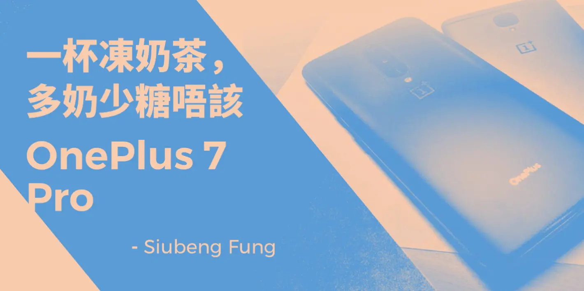
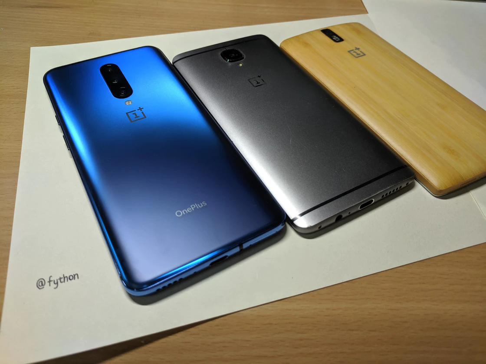
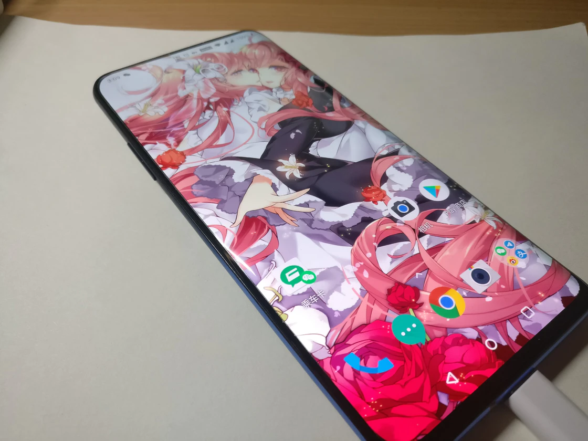
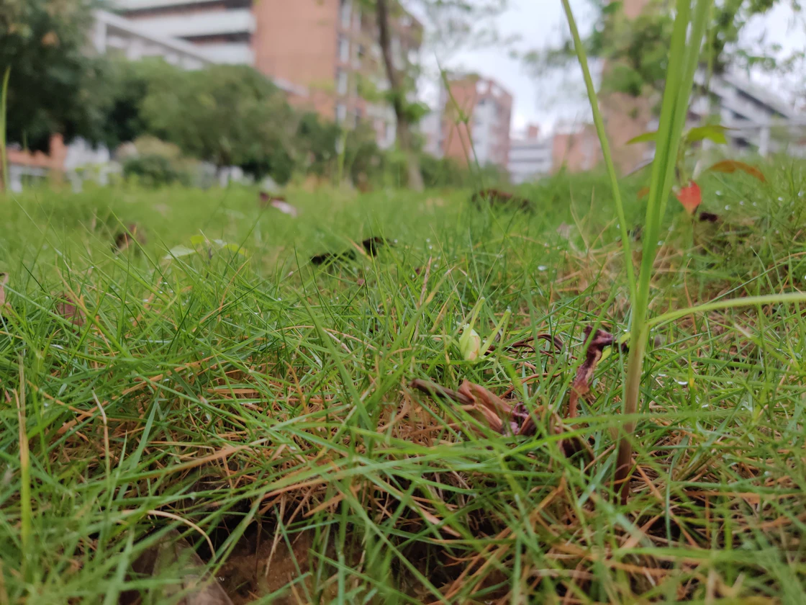

> 之所以称 OnePlus 7 Pro 为冻奶茶，是因为它顺滑而又苦涩着。

# 总览

**外观：**★★★★

**性能：**★★★★★

**屏幕：**★★★★★

**续航：**★★★★

**系统：**★★★★

**相机：**？

**外放：**听个响

# 外观

我买到的是星雾蓝版本，对，就是那个最热门的版本。

其实起初，我更想等等一个月后发售的皓月金，因为我一直以来都更钟意白色和熊猫配色，就像魅族 MX 系列和 Pixel 2 XL 那样。

但在快闪店上手后，星雾蓝版本采用的磨砂玻璃把我的心留住了。它的曲线与材质让我回想起 OnePlus One 的 Baby Skin。虽已不及当年的
“真〇〇爽” ，但仍旧做到了舒适与实用的巧妙结合。

磨砂带来的最大好处是防滑：即便是 206g，6.67 吋的大块头也因此能被牢牢掌控，沉重感也因此大减，整体握持感甚至优于仅 185g 的
Essential Phone。

也许是因为大家都看到了磨砂的优点，星雾蓝才会被一抢而空，这导致一加员工现在被迫在微博不停地宣传黑色版本，但相信我，星雾蓝是你最值得种草的配色。

# 性能

OnePlus 7 Pro 已不局限于每年换 SoC 带来的性能提升。

SD855 + LPDDR4X RAM + UFS 3.0，这些诚意满满的堆料，让 OnePlus 7 Pro 的应用加载速度都大幅领先于同期 Android。

一句话，这就是目前最快的 Android 旗舰。

# 屏幕

其实屏幕已经成了 OnePlus 7 Pro 卓越性能的一部分，这块三星定制的 2K 90Hz 流体屏令我流连忘返。

更高的分辨率使色彩和文字的显示更为细腻，保持长时间观看也不会像看 OnePlus 3T 那样疲劳，以前睡觉前看 OnePlus 3T 会比看其它
LCD 手机早睡至少半小时（迫真）

这块 AMOLED 即便不开启 DC 调光模式，在高达 360Hz 的 PWM 下低亮度依旧有很好的表现。

至于 90Hz，在适应这块屏幕后，回看 60Hz 的屏幕，在没有密集 CPU/IO 消耗情况下，同样的动画效果，同样的列表滑动，我都会感到明显的拖影。

而视频和游戏，或因为画面源限制，或因为一加还未完全开放游戏帧率限制，最高只有 60FPS，着实有些可惜。

另外有些不足的是，烈日下的激发亮度没有想象中那么高，直视还是有些困难。

专业的“客观”数据测试和 HDR10+ 效果，各位可以参考 DisplayMate 或 Notebook Check 的介绍

http://www.displaymate.com/OnePlus_7Pro_ShootOut_1P.htm

https://www.notebookcheck.net/OnePlus-7-Pro-Smartphone-Review.420598.0.html

# 续航

虽有 4000mAh，但受这块屏幕的影响，中度使用只能坚持 10 - 12 小时，但因为有 Warp 30W，如果不是长时间外出问题不大。

固然，手动改成 60Hz + 1080p 使用就能大大延长续航时间，但这样降格就舍弃了旗舰体验，斟酌损益，还是一天两充吧。

这一代最令人惊喜的是，不仅是 Warp，OnePlus 7 系列新增了 5V/3A PD 兼容，但这并不是张老板大发慈悲，OPPO Reno 也即将 OTA
支持这一特性。

# 触控

很少有测评提及触控，但曲面屏的 OnePlus 7 Pro 让我不得不提。

人机交互的 90% 都通过触控完成，90Hz 的屏幕显示也应有更好的触摸反馈。作为一个休闲音游玩家，我也不会放过对触控低延迟、不断触的追求。OnePlus
7 Pro 很好的做到了这一点，关于各种音游的判定偏移在文末会给出参考。

回到日常使用场景，良好的防误触机制使曲面屏并未与误触划上等号。但如果是躺着玩手机，手握得更紧时，防误触机制就会触发得更频繁。有时想点击边缘的按键会出现断触，比如打字时。官方说，众多输入法已适配曲面屏，但其中并没有包括
Gboard :(。

震感也在这里说吧：不错，但还未超越 iPhone，有待继续提升。

# 相机

唔，其实挺想跳过这一部分的，先留个坑吧。

值得一提的是，前置摄像头是升降结构，但人脸解锁速度比想象中要快，就是动作有点鬼畜（弹出来一下又马上收回），
我还是继续只用屏下指纹吧。

# 系统

轻快无负担的 H2OS，还是那么惹人喜爱。

购买前，很惊喜地收到了给 3/3T 的 9.0 更新，提前体验了大部分功能。

拿到 OnePlus 7 Pro 发现还多了 Fnatic 游戏模式、阅读模式和全面屏手势等功能，但也随之而来了一些 bug：

1. 有些应用会莫名连接不上网络，强制停止之后重开就正常了。
2. Google Play 商店没法安装带数据包的应用/游戏。

但以上问题在刷到 Oxygen OS 9.5.4 后，即便没有清除应用数据，也全部解决了（

H2OS 结合 OnePlus 7 Pro 的硬件特性，提供了 “添加屏幕刷新率、分辨率和屏幕指纹快捷方式”
的功能。另外可定制的地方也比较多，但息屏通知的边缘光效只有默认一种样式且不能关闭，也没有提供类似三星的曲边快捷工具栏，期望后续系统更新能继续完善吧。

考虑到可能 90Hz 屏需要系统支持，短期内暂不打算刷其它 ROM（官方 Android Q Beta 在 5月 21 日发售当天就提供了下载，但我不想刷qwq）。

# 玄学（音响）

立体声效果真的很一般，毕竟还是借用了听筒，但有总比没有强。

# 尾巴

OnePlus 7 Pro 最大的卖点无非是它的屏幕，因为时至 2019 年中，各家 855
旗舰已悉数亮相，只有足够差异化的卖点才能赢得钞票，产品力不足的手机自不必说，但没有亮点的水桶机也会一同被网友的口水淹没。

而一加做到了差异化。

这块流体屏仅凭刷新率就足以让用户买单，而首发的 UFS 3.0 也仿佛降维打击了所有其它 855 旗舰，其它诚意的配置也让这个机型成就了一加有史以来最高的曝光度。

但抛开配置表，这个机器除了屏幕和性能，还剩下什么？

适配不足的振动马达，仅对 DxO 优化的相机，只能听个响的双扬声器，弧度过大的曲面，超过 200g 的重量，依旧寡淡的系统...

纸面之外，它的不讲究犹存。

但无论如何，以上大部分的不足也许都是暂时的，由于硬件基础良好，这些缺点很容易通过一个又一个 OTA 得到补足。

正如标题所言，OnePlus 7 Pro 就像冻奶茶，不真正品尝，感受不到这复杂的口感。它闻着香，入口柔，只是后味涩。

但苦涩之后，往往会回甘。

# 附录

## A

各类音乐游戏判定偏移参考（基于 Android 9.0 H2OS 9.5.2、耳机状态）

**iM@S Million Live! Theater Days (MLTD):** 0

**BanG Dream (邦邦):** 0

**iM@S Cinderella Starlight Stage (CGSS):** 12-14

**Arcaea:** 120-150

## B

这次一加据说存在小部分溢胶、镜头进灰的现象，某风姓男子和一些群友没有翻车的 7 Pro 是 5.20 产+官网渠道，发现出问题较多的是京东第一批，我的
5.17 产+官网渠道表示暂时没有遇到问题。目前尚未确认哪一批次出现质量问题较多，希望后续批次尽快解决品控问题。

## C

一加 7 Pro 的 Bootloader 不支持通过 fastboot 不刷入分区直接 boot image（`fastboot boot`），目前要安装 TWRP Recovery
需要先切换到另一个闲置的 Slot 使用 TWRP Image 覆盖 Boot 分区启动，再在进入 TWRP 后切换到原来使用的 Slot 刷入 TWRP
卡刷包。如果你有 Patched 好对应系统版本的 Boot image，那就只要一次 `fastboot flash` 就好了。

tsuBench © 2019
