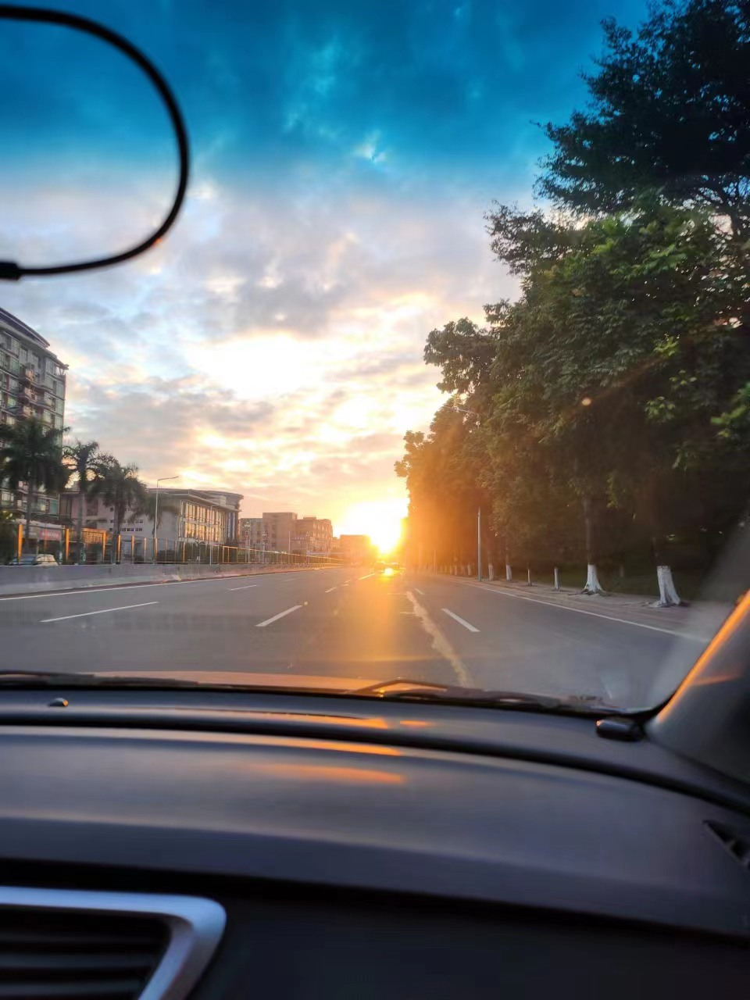

## 最后一次封控

2022 年 9 月，打算国庆自己去一次澳门自由行。

为什么会想到去澳门？一直有了解疫情期间澳门的四五星级酒店一晚住宿并不贵，甚至有些比广州还要便宜；另外作为一个街机音游玩家，玩到机种齐全的官版街机意味着需要出境，去澳门会是一个不错的选择。

国庆前一天，早上提前出门去一趟海珠办证大厅，才发现港澳通行证自助签注机关停很久都没有恢复，去澳门也需要人工窗口办理，需要提前 7 天预约办理，且不能当天立刻拿到证件，还需要等七天工作日内邮寄回手上……

功课没做够，没想到一等就是等到了长达一个多月的广州疫情封控😇。

广州海珠发布公众号

确诊病例最多的海珠区首当其冲，起初还能点点外卖，解决常年晚上加班的互联网民工吃饭难题，后面区内的食肆还是逃不掉停止外卖配送的命运，吃方便食品配维生素补充不是长久之计，便买点肉菜开始自己做饭了。

干炒牛河备料

自制奶茶

搞掂

虽然自己简单的饭菜还是能做做，但是一个人做饭自己吃的边际成本太高了，当时以为疫情很快结束，也没有和室友协商一起做多人份的菜。每天就是早餐小面包，正餐最多一顿自己做，剩下一顿方便食品，解决三餐难题。

自热火锅

星洲炒米

自热米饭

自制柠檬茶

每天就和朋友、新人同事交流不同区域的疫情防控发生了什么变化、如何维持生活运作，租房里堆了很多快递的纸盒（纸盒囤着是想后面一次性丢掉，生活垃圾定期清理的）。

突然某一天，同住一个小区的同学提议周末买多点菜，去他那涮火锅，当然是 “猴啊”🐵！

自己做菜比较少，每次很难控制分量，就比较少买难保鲜的蔬菜，能涮火锅当然少不了绿色蔬菜。

就这样不知道熬过了多少个日夜，起初还会期待海珠区封控措施到期的那天开放，无数个 “加钟” 后心里清楚每日新增病例数一天不降到比较安全的水平，很难看到解封的通知。

然而，还没等到新增病例数下降，却等来了另一个令人惊讶的消息！？

## 突如其来的解封

2022 年 12 月 7 日，卫健委发布《[关于进一步优化落实新冠肺炎疫情防控措施的通知](http://www.nhc.gov.cn/xcs/gzzcwj/202212/8278e7a7aee34e5bb378f0e0fc94e0f0.shtml)》，也许对于很多 “开放党” 来说是一个莫大的福音，生产、商务都可以继续进行，经济将会引来一阵复苏。但一直希望开放一点的我感觉不是一个好主意，不过是 “一刀切” 的拉闸从 “封” 切向了 “开”，当中的利弊很多百姓仔细思考都能清楚的。

不同人面对不同的问题内心权重不同，有不同的声音很正常，但当时每天刷微博都看到很多 “封控党” 阴阳怪气冷嘲热讽，很想按关键词屏蔽掉疫情讨论，但又不想错过防控动态，就很无奈😑

突如其来的解封，紧接而来的是 “买药难”、“核酸难”、“看病难”，我也不清楚医疗系统是否已经做过准备了，至少作为一个百姓看来，似乎这三年基层管理水平并没有多少成长，附近的社区都没有主动组织帮居民团购药物。

同事群关于 “药” 的聊天记录

幸亏我刚解封就在京东下单药物了，对于个人而言这段时间没有什么影响，也第一时间通知在二线城市的爸妈也囤点药物，未雨绸缪是个好习惯。

2022-12-03 的药品订单

海珠解封第一周，我们公司还是保持居家办公，打听到一些同事居家也中招的消息，在那时哪怕是 Omicron 变种大家都是很畏惧的，自认为属于 “开放党” 的我还挺不想去上班的，毕竟做好 “战斗” 准备了，也不会临阵脱逃~

## 难逃一阳

刚回去第一周，就有同事陆续中招，和我同一个小区的同学也中招了，跟我同一个楼层，心想我应该也逃不掉了，就这样每天在未知的羊群中人来人往，成为了恢复上班后第一周的 “幸存者”。

好景不长，尽管公司内我们小组一直都是很坚挺，但日常接触并不仅仅是同事，两点一线的宅生活还是会和室友、外卖配送员有接触，周末疑似在家暴露在病毒下，第二周忽然有点畏寒，第二天就开始直奔 38 度发高烧。

中招后每日体温测量

印象中从大学四年到工作两年都没有体会过发烧，这次发烧还是反反复复持续几天的，并且要在不能与其他人直接接触避免传染他人的前提下，完成定时测温、喝水、吃药等。头几天高烧比较厉害，非常难受的情况下要独自换湿毛巾敷额头物理降温，简直了……

那几天给和家里人分享新冠中招后的病症、措施，还是挺担心老爸、老妈和外婆的身体健康，家里其他老人走得比较早，免受了新冠病毒折磨的痛苦。毕竟全面放开后广州附近的二线城市也会传染开来，在我中招一周后老爸老妈也陆续中招，每天问他们身体状况，似乎症状要比我轻一些，但毕竟年纪大了担心后遗症或者肺部感染，又可能对我隐瞒真实情况，很庆幸确实恢复得不错。

也就是这些日子开始，对现在的亲人倍感珍惜，老妈对我的唠叨终究转变成我对老妈的唠叨，毕竟老妈太顽固了，以前都是说不过就不争执了，现在隔三岔五就会再确认下有没有按我的说法去做。（也许我的强迫症就是这么来的……）

## 过年

以前经常有人问我，离家这么近是不是经常回去，其实也只是节假日才回去，有时候节假日隔得比较久就很长时间没回去。

这次元旦又因为我刚康复不久，担心复阳或者传染其他变种给家里人，回家的想法也搁置了，而上次回去是 2022 年的国庆。

回家路上的夕阳

过年提前请了两天假，回去那天是年廿八，按广东人的习俗 “年廿八，洗邋遢”，这一天是要帮家里打扫卫生的，不过老妈在家早就打扫完了，回去要帮忙整理的事情就剩下了买年桔、年花，以及贴挥春（粤语称呼春联、对联的方式）。

花市

买回去的年桔和年花

过年惯例年前和几个老朋友约饭聚会，除夕回老家和外婆、表弟妹吃团年饭，初一之前，一切都如往日。

而初二以后，往年都是回老爸那边的村子拜年，当学生仔假期长的时候也会回老妈那边的村子拜年，今年是第一次两边都没有回去，本来就住在村子里的亲戚大概还有串门拜年、打打麻将，不过外出打工的都约定暂时不回去，避免把新冠带给老人。

亲戚拜年环节被省略，也达成了第一次过年没有收到 5/10/20 块钱的小利是（粤语称呼红包的方式）。

广东亲戚朋友给的红包普遍不会很大，只有直系亲属会给比较大的，平均也是 100 来块一封；而其他亲戚或者父母的同事朋友会给 5-20 的小红包，图个吉祥。今年没有串门，因此也没有收到这些小红包，最多在家族群文字拜个年，逃过了七姑八姨的 “当面处刑”：有冇揾返个女朋友啊 blabla 之类的。

旗峰公园烧香祈福的地点

没有拜年环节，空出来的时间就带爸妈在城市里的公园逛逛，呼吸下新鲜空气，人们沐浴、享受着 “摆脱” 疫情的春风。

但疫情防控留下的各种痕迹还没有褪去，一些可能也不会消失了。

## 珍惜当下

今年我的春节简化了很多，但外面却异常热闹，人们买了很多烟花爆竹，在好几年不准燃放的城市中重新点亮了往年漆黑的夜空，从年前到初七每天晚上都充满了烟花绽放的爆炸声，早上醒来又能听到窗外楼下响亮的爆竹。

据说广东不少村子还组织了醒狮表演，在我居住的城市就没有这么隆重了。

烟花、爆竹、醒狮，在人们自发的无数个小 “庆典” 中承载着他们的喜悦和期望，让大家对未来有更多的期待。

当下所拥有的事物也要好好珍惜，再去开始全新的旅程。
